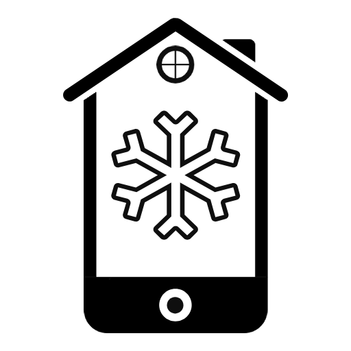
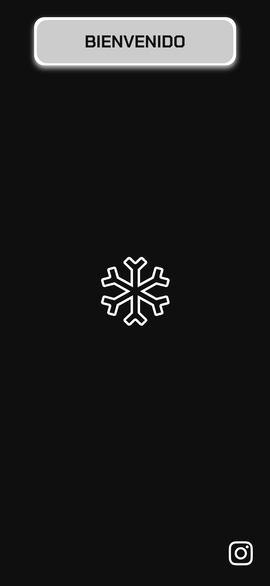
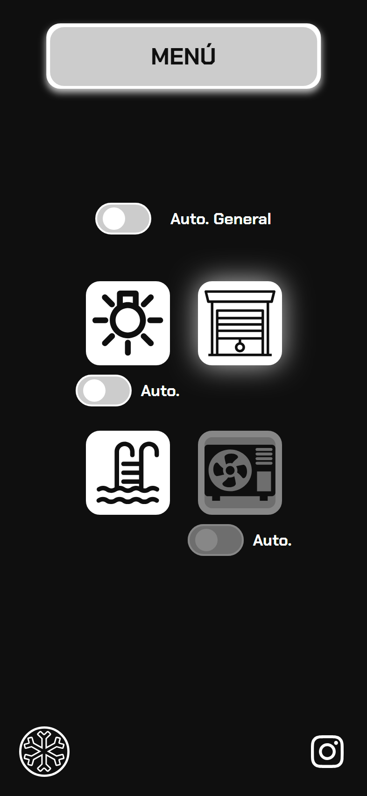
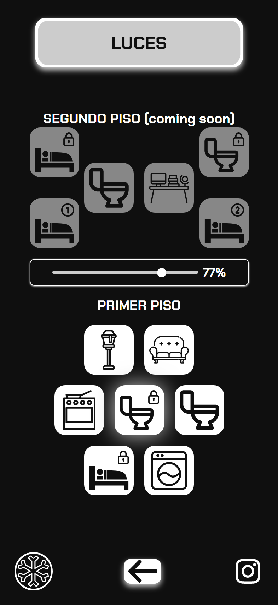

<h1 align="center"><b> Micro:Bit Control - VISUAL OVERVIEW </b></h1>

This is a web application designed to manage and control a smart home environment via Bluetooth connectivity, utilizing the Micro:bit as the central microcontroller.

Developed using a lightweight stack of HTML5, CSS3, and vanilla JavaScript, the interface allows for seamless device interaction directly from the browser. It serves as the legacy version and technical foundation for the project's successor, which transitions to the ESP32 platform to enable enhanced performance and real-time data synchronization.
  

  <table>
    <tr>
      <td align="center"><b>CONNECT VIA BLUETOOTH</b> </td>
      <td align="center"><b>MENU</b> </td>
      <td align="center"><b>LIGHTS</b> </td>
    </tr>
    <tr>
      <td></td>
      <td></td>
      <td></td>
    </tr>
  </table>

